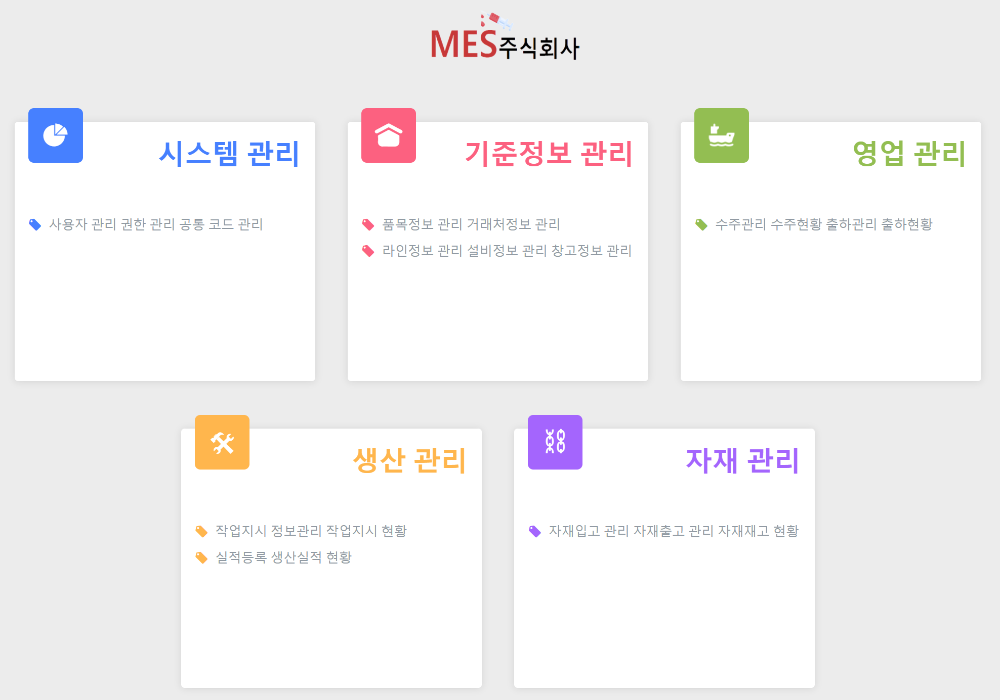

# ◆ MES(주) 주사기제조공장의 생산관리시스템(MES) ◆

 

## ◆ 호스팅 사이트 : http://itwillbs19.cafe24.com/login/login ◆
### ◆ 사용 툴 : STS, Workbench
### ◆ 사용 DB : MySQL v8.0.17
### ◆ 사용언어 : JAVA, JSP, AJAX, JQUERY, HTML, CSS, JAVASCRIPT
### ◆ 주제 : Spring 기반 MES시스템 설계

---

### ◆ 프로젝트 기간 : 3월 8일 ~ 4월 14일
### ◆ 담당 역할 : 회의진행, 일정관리
### ◆ 담당 기능 : DB설계, 로그인, 사용자관리, 공통코드관리, 홈페이지 CSS

---

## <개발 코드>

### ◆ 로그인, 사용자관리, 공통코드관리 ◆

* Model,Controller

  * [로그인 JAVA 파일](https://github.com/Baek0218/MESProject/blob/develop/MESProject/src/main/java/com/itwillbs/login)
 
  * [사용자관리 JAVA 파일](https://github.com/Baek0218/MESProject/blob/develop/MESProject/src/main/java/com/itwillbs/member)
  
  * [공통코드 JAVA 파일](https://github.com/Baek0218/MESProject/blob/develop/MESProject/src/main/java/com/itwillbs/comcode)
 
* View

  * [로그인 화면](https://github.com/Baek0218/MESProject/blob/develop/MESProject/src/main/webapp/WEB-INF/views/login)
  
  * [사용자관리 화면](https://github.com/Baek0218/MESProject/blob/develop/MESProject/src/main/webapp/WEB-INF/views/member)
  
  * [공통코드 화면](https://github.com/Baek0218/MESProject/blob/develop/MESProject/src/main/webapp/WEB-INF/views/comCode)

---
